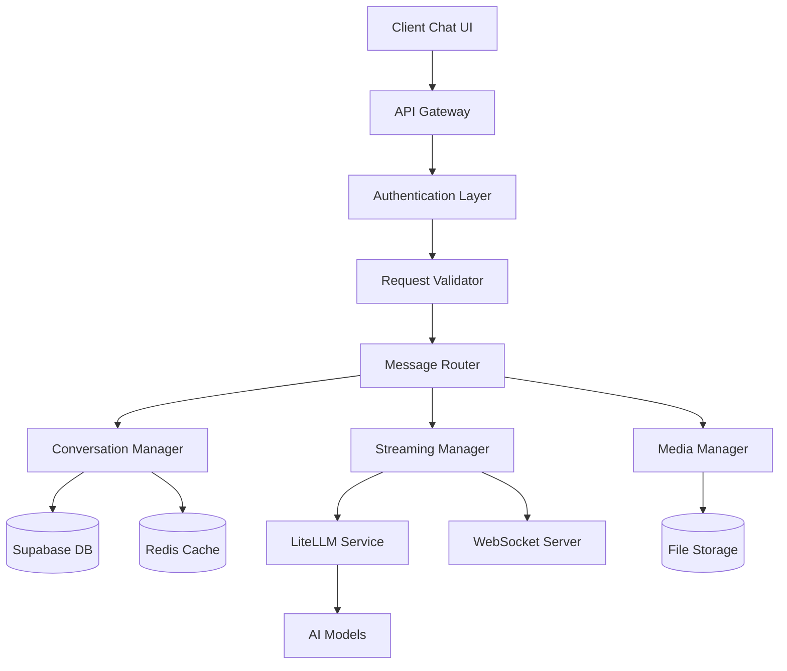
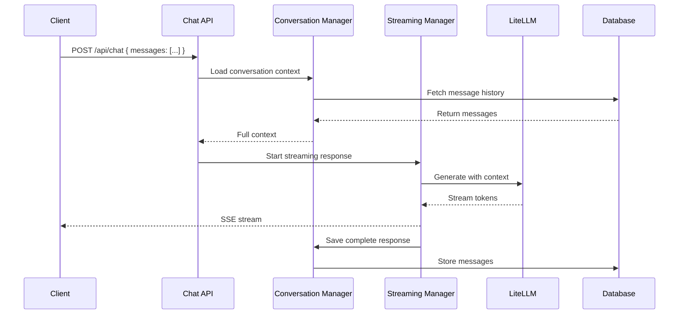

# Design Document - Chat API Enhancement

## Overview

Cette conception transforme le système de chat de Chifa.ai en une plateforme sophistiquée utilisant les standards modernes des APIs conversationnelles. L'architecture adopte le format de messages structurés, implémente le streaming en temps réel, et intègre des fonctionnalités avancées comme la gestion de contexte, les attachements, et l'intégration LiteLLM personnalisée.

## Architecture

### High-Level Architecture



### Message Flow Architecture



## Components and Interfaces

### 1. Enhanced Message Schema

```typescript
// Core message structure (OpenAI compatible)
interface ChatMessage {
  id?: string
  role: 'user' | 'assistant' | 'system'
  content: string | MessageContent[]
  name?: string
  function_call?: FunctionCall
  tool_calls?: ToolCall[]
  timestamp?: string
}

// Rich content support
interface MessageContent {
  type: 'text' | 'image' | 'file'
  text?: string
  image_url?: { url: string; detail?: 'low' | 'high' | 'auto' }
  file?: { url: string; type: string; name: string }
}

// Enhanced request format
interface ChatRequest {
  messages: ChatMessage[]
  conversation_id?: string
  pharmacy_id?: string
  model?: string
  temperature?: number
  max_tokens?: number
  stream?: boolean
  tools?: Tool[]
}
```

### 2. Conversation Manager

```typescript
class ConversationManager {
  async createConversation(userId: string, pharmacyId?: string): Promise<Conversation>
  async getConversation(id: string, userId: string): Promise<Conversation | null>
  async addMessage(conversationId: string, message: ChatMessage): Promise<void>
  async getMessages(conversationId: string, limit?: number): Promise<ChatMessage[]>
  async updateConversationTitle(id: string, title: string): Promise<void>
  async deleteConversation(id: string, userId: string): Promise<void>
  
  // Context management
  async buildContext(conversationId: string): Promise<ChatMessage[]>
  async summarizeOldMessages(messages: ChatMessage[]): Promise<ChatMessage>
  async getRelevantContext(query: string, conversationId: string): Promise<ChatMessage[]>
}
```

### 3. Streaming Manager

```typescript
class StreamingManager {
  async streamResponse(
    messages: ChatMessage[],
    options: StreamOptions,
    onToken: (token: string) => void,
    onComplete: (fullResponse: string) => void,
    onError: (error: Error) => void
  ): Promise<void>
  
  async createStreamingEndpoint(conversationId: string): Promise<string>
  async handleStreamingConnection(connectionId: string): Promise<void>
  async broadcastToStream(streamId: string, data: any): Promise<void>
}
```

### 4. Enhanced LiteLLM Integration

```typescript
class EnhancedLiteLLMService {
  async generateResponse(
    messages: ChatMessage[],
    pharmacyContext: PharmacyContext,
    options: GenerationOptions
  ): Promise<AsyncIterable<string>>
  
  async getPharmacyVirtualKey(pharmacyId: string): Promise<string>
  async buildSystemPrompt(pharmacyContext: PharmacyContext): Promise<string>
  async trackUsage(pharmacyId: string, tokens: number, cost: number): Promise<void>
  
  // Advanced features
  async analyzeImage(imageUrl: string, context: string): Promise<string>
  async extractDocumentContent(fileUrl: string): Promise<string>
  async generateTitle(messages: ChatMessage[]): Promise<string>
}
```

### 5. Media Manager

```typescript
class MediaManager {
  async uploadFile(file: File, userId: string): Promise<UploadResult>
  async processImage(imageUrl: string): Promise<ImageAnalysis>
  async extractText(documentUrl: string): Promise<string>
  async generateThumbnail(imageUrl: string): Promise<string>
  async validateFileType(file: File): Promise<boolean>
  async scanForSensitiveContent(content: string): Promise<SecurityScan>
}
```

## Data Models

### Enhanced Database Schema

```sql
-- Conversations table (enhanced)
CREATE TABLE conversations (
  id UUID PRIMARY KEY DEFAULT gen_random_uuid(),
  user_id UUID NOT NULL REFERENCES auth.users(id),
  pharmacy_id UUID REFERENCES pharmacies(id),
  title TEXT NOT NULL DEFAULT 'New Conversation',
  status VARCHAR(20) DEFAULT 'active', -- active, archived, deleted
  metadata JSONB DEFAULT '{}',
  created_at TIMESTAMP WITH TIME ZONE DEFAULT NOW(),
  updated_at TIMESTAMP WITH TIME ZONE DEFAULT NOW(),
  last_message_at TIMESTAMP WITH TIME ZONE DEFAULT NOW()
);

-- Messages table (enhanced)
CREATE TABLE messages (
  id UUID PRIMARY KEY DEFAULT gen_random_uuid(),
  conversation_id UUID NOT NULL REFERENCES conversations(id) ON DELETE CASCADE,
  role VARCHAR(20) NOT NULL, -- user, assistant, system
  content JSONB NOT NULL, -- Rich content support
  metadata JSONB DEFAULT '{}',
  tokens_used INTEGER DEFAULT 0,
  cost_cents INTEGER DEFAULT 0,
  processing_time_ms INTEGER,
  created_at TIMESTAMP WITH TIME ZONE DEFAULT NOW(),
  
  -- Search and indexing
  content_vector vector(1536), -- For semantic search
  content_text TEXT GENERATED ALWAYS AS (content->>'text') STORED
);

-- Message attachments
CREATE TABLE message_attachments (
  id UUID PRIMARY KEY DEFAULT gen_random_uuid(),
  message_id UUID NOT NULL REFERENCES messages(id) ON DELETE CASCADE,
  file_url TEXT NOT NULL,
  file_type VARCHAR(50) NOT NULL,
  file_name TEXT NOT NULL,
  file_size INTEGER NOT NULL,
  analysis_result JSONB,
  created_at TIMESTAMP WITH TIME ZONE DEFAULT NOW()
);

-- Conversation analytics
CREATE TABLE conversation_analytics (
  id UUID PRIMARY KEY DEFAULT gen_random_uuid(),
  conversation_id UUID NOT NULL REFERENCES conversations(id),
  pharmacy_id UUID REFERENCES pharmacies(id),
  message_count INTEGER DEFAULT 0,
  total_tokens INTEGER DEFAULT 0,
  total_cost_cents INTEGER DEFAULT 0,
  avg_response_time_ms INTEGER DEFAULT 0,
  satisfaction_score DECIMAL(3,2),
  created_at TIMESTAMP WITH TIME ZONE DEFAULT NOW(),
  updated_at TIMESTAMP WITH TIME ZONE DEFAULT NOW()
);
```

### Context Management Strategy

```typescript
interface ContextStrategy {
  maxTokens: number
  summarizationThreshold: number
  relevanceThreshold: number
  retentionPolicy: 'all' | 'recent' | 'relevant'
}

class ContextManager {
  async optimizeContext(
    messages: ChatMessage[],
    strategy: ContextStrategy
  ): Promise<ChatMessage[]> {
    // 1. Calculate total tokens
    const totalTokens = this.calculateTokens(messages)
    
    if (totalTokens <= strategy.maxTokens) {
      return messages
    }
    
    // 2. Keep system messages and recent messages
    const systemMessages = messages.filter(m => m.role === 'system')
    const recentMessages = messages.slice(-10)
    
    // 3. Summarize older messages if needed
    const olderMessages = messages.slice(0, -10)
    const summary = await this.summarizeMessages(olderMessages)
    
    return [...systemMessages, summary, ...recentMessages]
  }
}
```

## Error Handling

### Comprehensive Error Management

```typescript
class ChatErrorHandler {
  async handleStreamingError(error: Error, streamId: string): Promise<void>
  async handleLiteLLMError(error: LiteLLMError): Promise<ErrorResponse>
  async handleValidationError(error: ValidationError): Promise<ErrorResponse>
  async handleRateLimitError(userId: string): Promise<ErrorResponse>
  
  // Recovery strategies
  async retryWithBackoff(operation: () => Promise<any>, maxRetries: number): Promise<any>
  async fallbackToSimpleResponse(messages: ChatMessage[]): Promise<string>
  async notifyUserOfError(userId: string, error: Error): Promise<void>
}

// Error types
enum ChatErrorType {
  VALIDATION_ERROR = 'validation_error',
  AUTHENTICATION_ERROR = 'authentication_error',
  RATE_LIMIT_ERROR = 'rate_limit_error',
  LITELLM_ERROR = 'litellm_error',
  STREAMING_ERROR = 'streaming_error',
  CONTEXT_TOO_LONG = 'context_too_long',
  MEDIA_PROCESSING_ERROR = 'media_processing_error'
}
```

## Testing Strategy

### Comprehensive Test Coverage

```typescript
// Unit Tests
describe('ConversationManager', () => {
  test('should create conversation with proper context')
  test('should handle message ordering correctly')
  test('should optimize context when too long')
  test('should maintain conversation state')
})

// Integration Tests
describe('Chat API Integration', () => {
  test('should handle full conversation flow')
  test('should stream responses correctly')
  test('should integrate with LiteLLM properly')
  test('should handle file uploads and analysis')
})

// Performance Tests
describe('Performance', () => {
  test('should handle 1000 concurrent conversations')
  test('should stream responses under 200ms latency')
  test('should optimize context in under 100ms')
  test('should handle large file uploads efficiently')
})

// Security Tests
describe('Security', () => {
  test('should validate all inputs properly')
  test('should prevent unauthorized access')
  test('should sanitize sensitive data in logs')
  test('should handle malicious file uploads')
})
```

## Performance Optimizations

### Caching Strategy

```typescript
class ChatCacheManager {
  // Conversation caching
  async cacheConversation(id: string, conversation: Conversation): Promise<void>
  async getCachedConversation(id: string): Promise<Conversation | null>
  
  // Context caching
  async cacheContext(conversationId: string, context: ChatMessage[]): Promise<void>
  async getCachedContext(conversationId: string): Promise<ChatMessage[] | null>
  
  // Response caching for similar queries
  async cacheResponse(queryHash: string, response: string): Promise<void>
  async getCachedResponse(queryHash: string): Promise<string | null>
  
  // Invalidation strategies
  async invalidateConversationCache(id: string): Promise<void>
  async invalidateUserCache(userId: string): Promise<void>
}
```

### Database Optimizations

```sql
-- Indexes for performance
CREATE INDEX idx_conversations_user_updated ON conversations(user_id, updated_at DESC);
CREATE INDEX idx_messages_conversation_created ON messages(conversation_id, created_at);
CREATE INDEX idx_messages_content_search ON messages USING gin(to_tsvector('english', content_text));
CREATE INDEX idx_messages_vector_search ON messages USING ivfflat(content_vector);

-- Partitioning for large datasets
CREATE TABLE messages_y2024m01 PARTITION OF messages
FOR VALUES FROM ('2024-01-01') TO ('2024-02-01');
```

## Security Considerations

### Data Protection

```typescript
class ChatSecurityManager {
  async encryptSensitiveContent(content: string): Promise<string>
  async decryptSensitiveContent(encryptedContent: string): Promise<string>
  async maskPIIInLogs(logData: any): Promise<any>
  async validateUserAccess(userId: string, conversationId: string): Promise<boolean>
  async auditConversationAccess(userId: string, conversationId: string): Promise<void>
  
  // Content filtering
  async filterSensitiveContent(message: ChatMessage): Promise<ChatMessage>
  async detectMedicalInformation(content: string): Promise<MedicalDataDetection>
  async applyDataRetentionPolicy(conversationId: string): Promise<void>
}
```

## Monitoring and Analytics

### Comprehensive Monitoring

```typescript
class ChatMonitoringService {
  // Performance metrics
  async trackResponseTime(conversationId: string, duration: number): Promise<void>
  async trackTokenUsage(pharmacyId: string, tokens: number): Promise<void>
  async trackErrorRate(errorType: string): Promise<void>
  
  // Business metrics
  async trackConversationLength(conversationId: string): Promise<void>
  async trackUserSatisfaction(conversationId: string, score: number): Promise<void>
  async trackFeatureUsage(feature: string, userId: string): Promise<void>
  
  // Alerts
  async alertOnHighErrorRate(threshold: number): Promise<void>
  async alertOnSlowResponse(threshold: number): Promise<void>
  async alertOnUnusualUsage(pattern: string): Promise<void>
}
```

Cette architecture sophistiquée transformera votre système de chat en une plateforme moderne, performante et évolutive, parfaitement adaptée aux besoins spécifiques de Chifa.ai dans le domaine pharmaceutique.